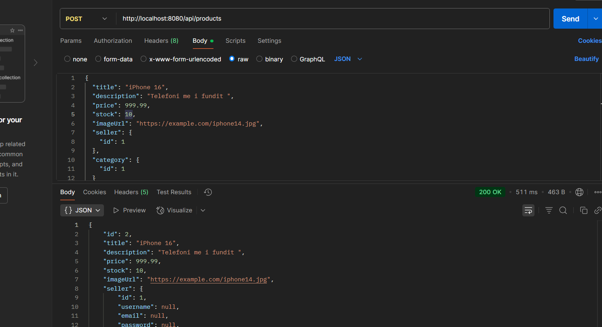
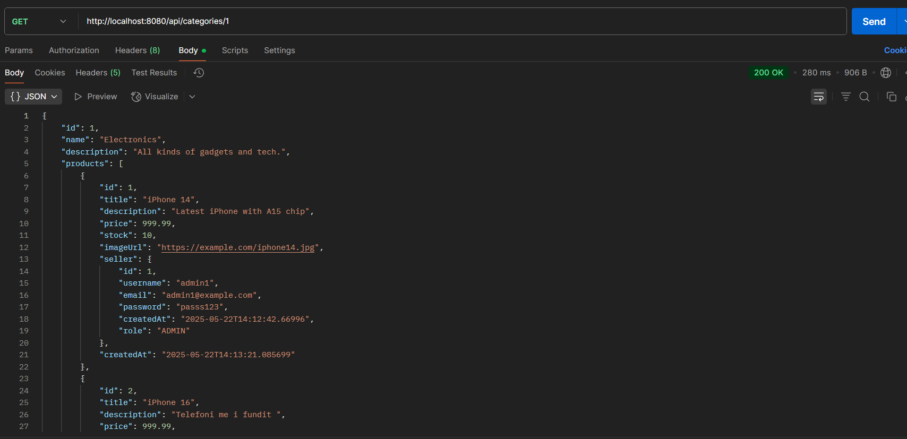

# FSEmart

FSEmart qendron per: **Fast, Secure, Excellent Product Ordering System**

Nje sistem i ngjashem me Temu per menaxhimin e produkteve, shitjeve, etc.

---

## Pershkrim i Projektit

Si fillim userat jane krijuar per arsye demonstrative ne kete hap te projektimit.  
Produkti dhe Kategoria jane me kryesore.

- Produkti do kete nje Kategori.
- Kategoria mund te kete disa produkte.

Kete kam implementuar sot duke pasur kujdes thirrjen e pafundme.

---

## Funksionalitete

### Shtimi i nje produkti

Kam shtuar dhe nje tjeter me perpara.

### Marrja e nje kategorie qe liston njekohesisht dhe produktet qe ka

---

## Shenim

Komentet qe kam bere pergjate file-ve jane per mua, qe ti perseris e ti mbaj mend, jo per shpjegim kodi.
