# FSEmart

FSEmart qendron per: **Fast, Secure, Excellent Product Ordering System**

Nje sistem i ngjashem me Temu per menaxhimin e produkteve, shitjeve, etc.

---

## Pershkrim i Projektit

Si fillim userat jane krijuar per arsye demonstrative ne kete hap te projektimit.  
Produkti dhe Kategoria jane me kryesore.

- Produkti do kete nje Kategori.
- Kategoria mund te kete disa produkte.

Kete kam implementuar sot duke pasur kujdes thirrjen e pafundme.

---

## Funksionalitete

### Shtimi i nje produkti

Kam shtuar dhe nje tjeter me perpara.

### Marrja e nje kategorie qe liston njekohesisht dhe produktet qe ka

---

### Te testojme autentikim qe shtova dhe te jap outputet 

Kam bere qe nje user i thjeshte me rol user te mos mund te shikoje gjith userat por admini po dhe e njejta logjike eshte
ndjekur per te tjerat gjithashtu : 

Tregon qe eshte forbidden 
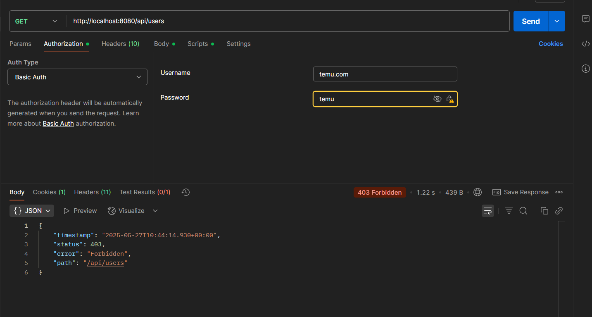 

Ndersa admini i shfaq  : 
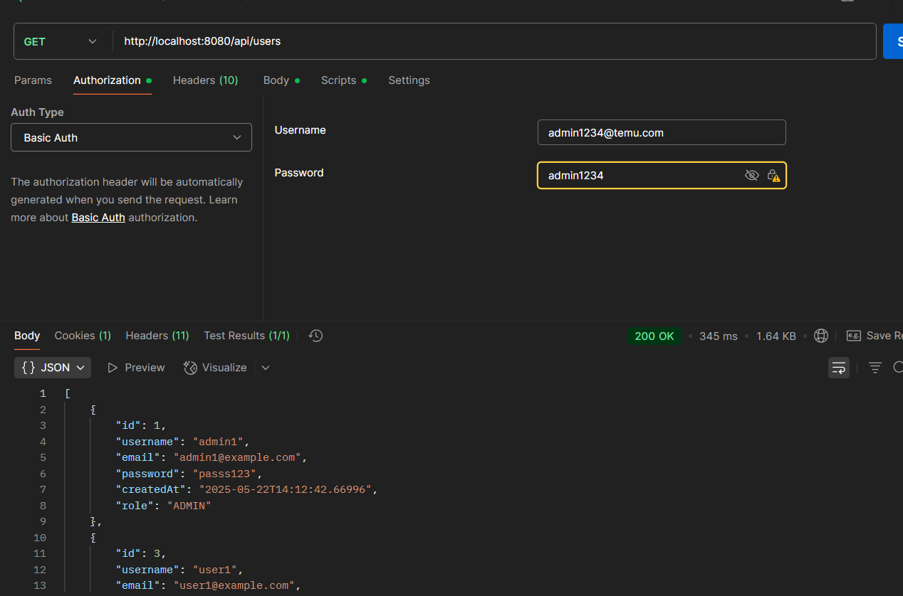

### Te testojme 2 nga validimet 

Kur tenton te fusesh nje user por pa username 
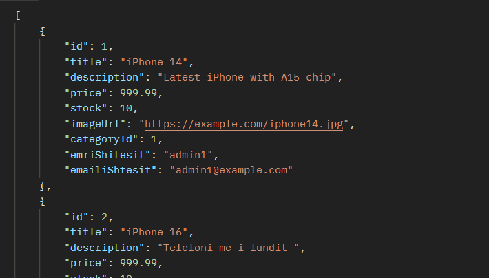

Kur tenton te fusesh nje email qe tashme ekzsiton
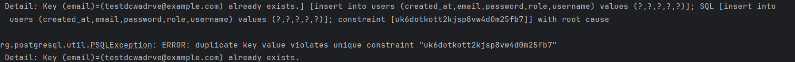

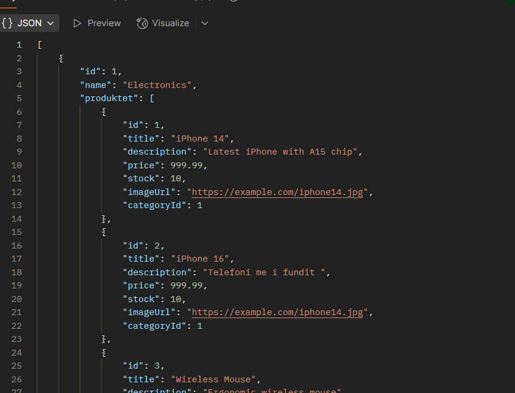

# Ndryshimet e bera sot

Dokument me ndryshimet funksionale dhe teknike te bera sot ne projekt.

---

## Ndryshime te entiteti Produkt

- Ne entitetin `Product` eshte shtuar nje reference ndaj `userSeller`.
- Kur nje user ben kerkese `GET` per produktet, i shfaqen edhe detajet e shitesit.

### Zgjidhja:
Per te kufizuar dhe kontrolluar cfare i shfaqet user-it ne varesi te rolit, jane krijuar dy DTO:

- `ProductUserDto`
- `ProductAdminDto`

---

## Ilustrime
SI admin : 

SI user : 
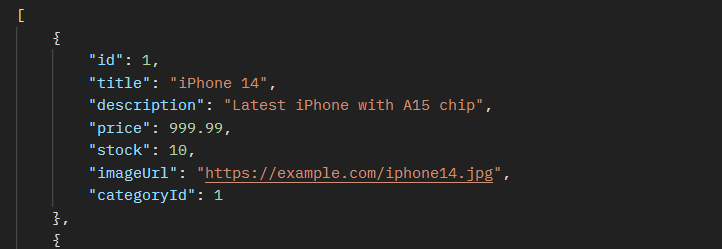

## Ndryshime te Kategoria

- Produkti ben pjese ne nje kategori.
- Ne momentin qe shfaqen produktet, shfaqen edhe detajet e kategorise .

### Zgjidhja:
Per kete arsye jane perdorur dy DTO:

- `CategoryUserDto`
- `CategoryAdminDto`

---
## Ilustrime

Si user : 

Si admin : 
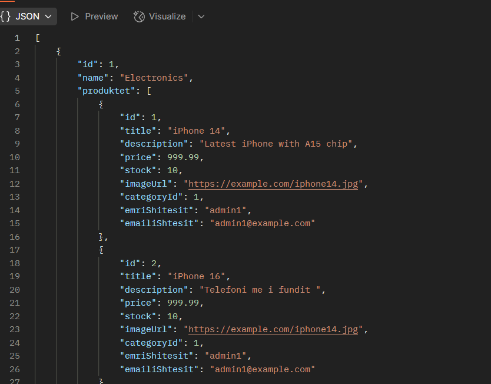

## Ndryshime te Porosia

- Kur nje user ose admin shikon nje porosi, per shkak te nesting dalin te gjitha detajet e produktit, shitesit etj.

### Zgjidhja:
Per te kufizuar keto te dhena, jane perdorur DTO specifike per orderat .

## Ndryshime te orderi
Useri nuk duhet te lejohet te bej place order per nje id qe nuk eshte e vetmja , per demonstrim useri mund te beje porosi
vetem per veten ndersa admini per te gjithe

SI user qe tenton te shtoje te nje user me id tjeter : 
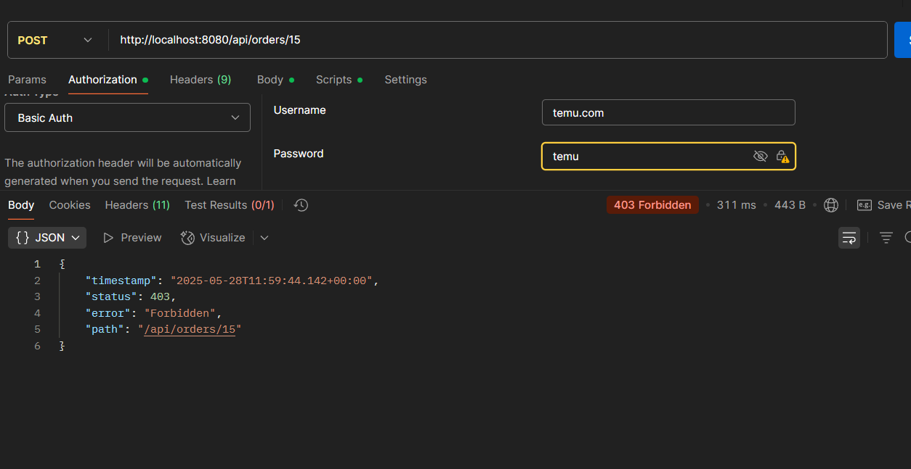
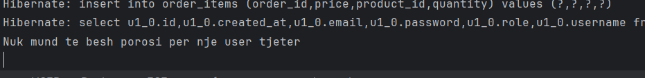

Useri  qe shton te id-ja e vet : 
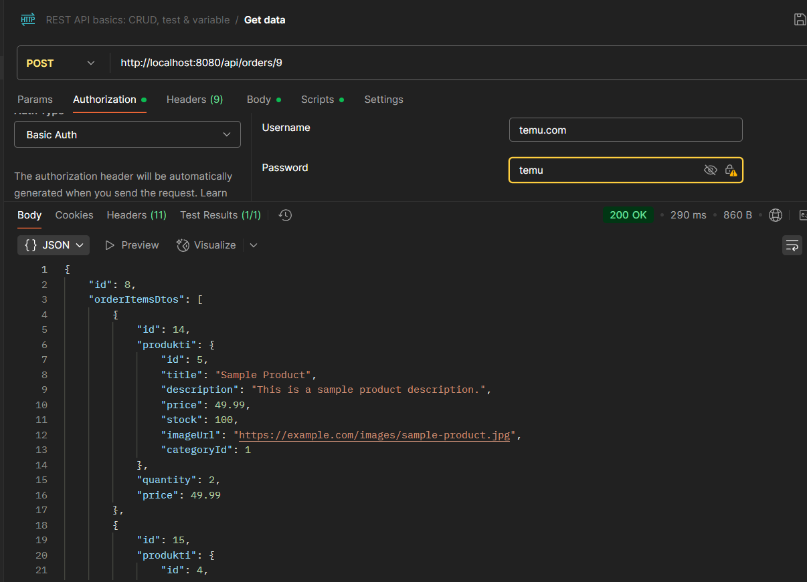

Admini qe mund te shtoje kudo : 
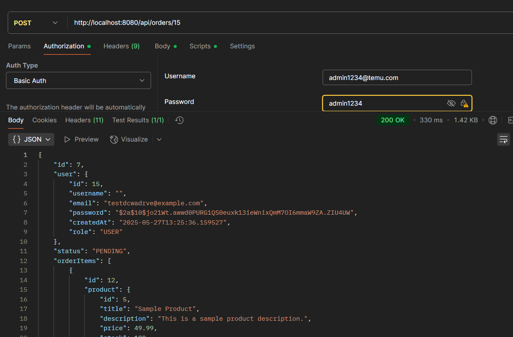

## Shenim

Komentet qe kam bere pergjate file-ve jane per mua, qe ti perseris e ti mbaj mend, jo per shpjegim kodi.

